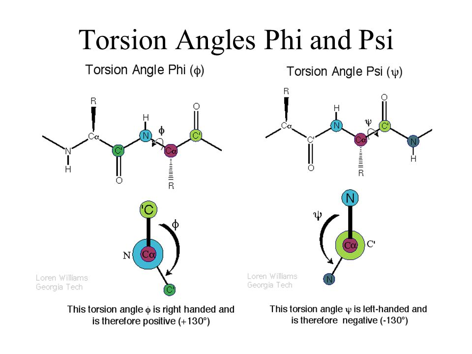

# Remodel Overview
Created Dec 2018 by Alex Chu. Last updated 181228 AEC

This is an overview of the key concepts underlying RosettaRemodel. RosettaRemodel is an app/executable in the Rosetta macromolecular modeling suite, which was developed originally in [the David Baker lab](https://www.bakerlab.org/) and is one of the most comprehensive, advanced software suites for biomolecular modeling. RosettaRemodel is one of the main apps in that framework for protein design. The docs for Rosetta, including RosettaRemodel, are very good and comprehensive and we don't intend to replace them - in fact, we'll refer to them frequently.

## The Remodel workflow

Remodel basically combines three main functions from Rosetta into a single app. These are backbone remodeling, sequence design, and relax/minimization. At any point, you might be using anywhere from one to all three of these functions in a single job. 

**Backbone remodeling** refers to altering the secondary structure (SS), or phi-psi torsional angles of the peptide backbone. Varying these phi-psi angles is what lets you define a segment of residues as an alpha helix, or a beta strand, or a loop. Remodel does this by fragment sampling: taking out the part of your protein you are trying to remodel, randomly taking protein "fragments," or small segments of native proteins structures from the PDB, and trying to stick them into your structure. If they stick nicely, then it keeps it there. If it doesn't, it tries again. If you have a discontinuity in the backbone (called a chainbreak), say if you are remodeling a chunk in the middle of your protein, it will try to close this break with fragment sampling and closure algorithms like CCD or KIC.

At this stage, the amino acid sequence (sidechains) are not super important. If you only use this function of Remodel, you might be surprised to see that your output structure is all valines; this is because Rosetta doesn't explicitly model all the sidechains in backbone mode. To make it computationally easier, it replaces all the sidechains with blobs, or "centroids," that are supposed to resemble the "average" sidechain. At output time, these centroids are saved to PDBs as valines.

**Sequence design** is the second stage that involves placing sidechains once you have a defined backbone. core/boundary, resfile, sasa.

**Relax** (also called refine or minimization) is a final energy minimization step that is carried out once you have a complete structure (backbone + sidechains). It's like when you scoop flour into a cup and shake it around a little to make sure any air pockets collapse and extra stuff falls away, so it all fits together nicely.

Here is a "subway map" for Remodel. It shows the workflow for the three functions/modes just discussed, and some of the common flags that might be used at each step. At the end of the day, you actually run Remodel by running (on the command line) the executable `/path/to/remodel.linuxgccrelease` (replace `/path/to` with the path to the directory where your Rosetta executables are) and giving it your a number of arguments. These arguments/flags/options allow you to give Remodel input structures, and blueprints and instructions for whether and how you want Remodel to do backbone, design, and/or relax on your structure.

- First you provide your input PDB structure and blueprint, and maybe some constraint or symmetry definition files. 
- Next it enters backbone stage, where it does fragment sampling and loop closure, and which should give you a complete backbone (you can skip this step with `-bypass_fragments` or `-bypass_closure`). 
- Next, if you have asked it to `-build_disulf`, it will try to design disulfide bridges. 
- Then it proceeds to design stage (you can skip this with `-remodel:design:no_design`). This is where you decide if design is guided by your blueprint, by the neighbors each residue has, or its buried surface area. 
- Then it proceeds to the relax stage, where you can choose what kind of relax algorithm (e.g. `-use_pose_relax` or `-use_cart_relax`) you want to run on the structure.
- Remodel then repeats the previous two steps by default 3 times, which you can change using `-remodel:dr_cycles [int]`, and saves the output files when you

## Blueprint syntax

## Some notes about implementation

jd2:no_output. Blueprint syntax.

## Some basic under-the-hood detail

You also might be wondering how exactly Rosetta picks fragments or places sidechains. Nearly all of the hard computational work in Rosetta is done with method called Monte Carlo sampling. The algorithm works like this:

1. 

and Rosetta score fn. This works by 1) pulling fragment libraries from the Rosetta database, 2) picking fragments from these libraries that match your SS definition

However scorefxn not perfect maybe one day!. A lot of the work is in recognizing and picking out good backbones, sidechains
